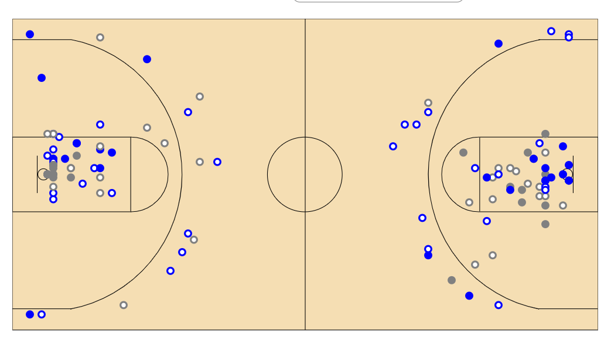
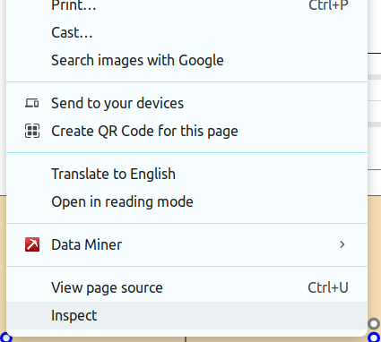
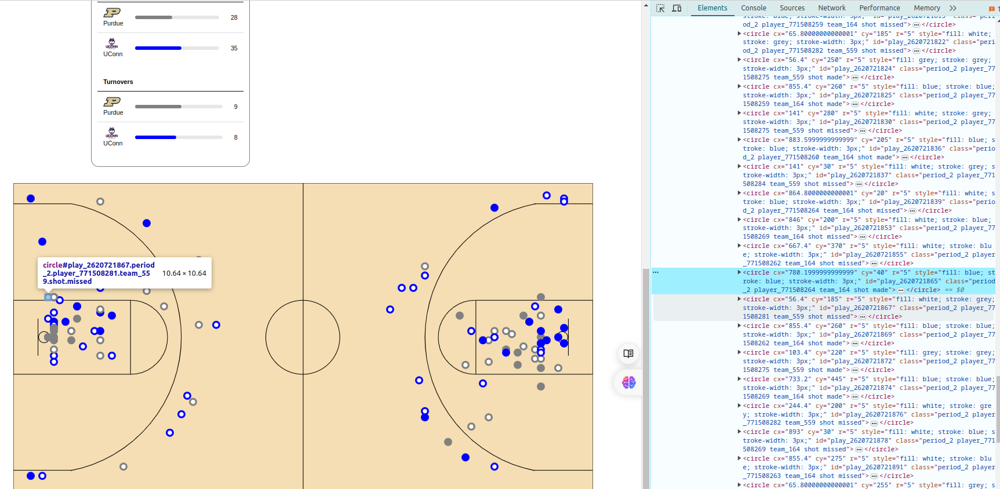
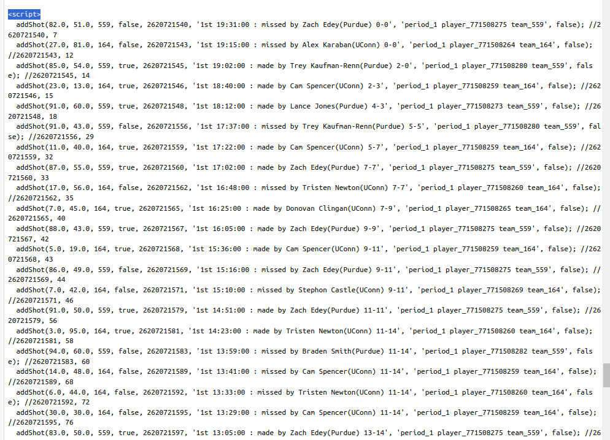

```{r setup, include=FALSE}
knitr::opts_chunk$set(echo = TRUE)
```

## Scraping Hidden Elements on a Website
 
In this tutorial, we are going to scrape hidden elements from a basketball court on the following website: <a href="https://stats.ncaa.org/contests/5254137/box_score">click here</a>. The data we are looking for includes details of each shot as shown in the picture below. Each dot gives information about the game, whether the player missed or made a shot, and the position on the court where he played the ball.
 
```{r echo=FALSE, fig.cap="Basketball cort", out.width = '100%'}

```

The first step is to click the inspect button and check under which div the circles fall.

```{r echo=FALSE, fig.cap="right click on the dot and then click incpect", out.width = '40%'}

```

You should see a screen like the one below with the highlighted part being the tag of the circle that you chose.


```{r , echo=FALSE, fig.cap="right click on the dot and then click incpect", out.width = '100%'}

```

If we scrape using rvest, you will notice that the results from the dots are empty.
The best way is to inspect the JavaScript elements of the site to see where the circles are placed.
To do so, we will use the libraries below:

```{r}
library(RCurl)
library(xml2) 
library(XML)
library(tidyverse)
library(rvest)

# Read the HTML content of the website
url<- "https://stats.ncaa.org/contests/5254137/box_score"

# parse url
url_parsed <- htmlParse(getURL(url), asText = TRUE)
#url_parsed # uncomment this line
```
Then we read the site details using the htmlParse function, which parses an XML or HTML file or string containing XML/HTML content.

```{r  echo=FALSE, fig.cap="The circle are under script", out.width = '100%'}

```

After careful inspection of the site, you will notice that the circles are under a tag called script which was not showing in the inspection tab. If we add that in the XPath or HTML node, then we will get our desired results. The code below shows the final code and the data cleaning part:

```{r}
#Read the url 
url <- "https://stats.ncaa.org/contests/5254137/box_score"
#Read the html tags
html <- read_html(url)

#Under div .p-4 we had hidden element called script
circle_data <- html %>%
  html_nodes('.p-4  script')

#Read text from the second element
raw_data<-circle_data[2]%>%
  html_text( trim = T)

# Split the text into individual shots
shots <- unlist(strsplit(raw_data, "\n", fixed = TRUE))

# Extract the components of the shot string
# Use a regular expression to match text within addShot
matches <-  gregexpr("(?<=addShot\\().+?(?=\\);)", shots, perl=TRUE)
# Extract the matched groups
shot_text <- unlist( regmatches(shots, matches))

#show what was contained in the addShot function
"function addShot(x, y, shooting_org, made, play_id, play_description, classes, show_highlight)"

# Convert the vector to a data frame by splitting each string into its components
shots_df <- do.call(rbind.data.frame, strsplit(shot_text, ", ", fixed = TRUE))
# Assign column names to the data frame
colnames(shots_df) <- c("x", "y", "shooting_org", "made", "play_id", "play_description", "classes", "show_highlight")
knitr::kable( head(shots_df))
#write.csv(shots_df,'shots_data.csv')
```

## Explanation of the Code
In this tutorial, we aimed to scrape hidden elements from a basketball game website. The steps we took are as follows:

Inspect the Website Elements:

We started by inspecting the website to identify where the shot data is stored. Using the browser's developer tools, we found that the shot data is hidden within JavaScript elements on the page.
Load Required Libraries:

We loaded necessary R libraries such as RCurl, xml2, XML, tidyverse, and rvest to help with web scraping and data manipulation.
Read the Website's HTML:

We used read_html from the rvest package to read the HTML content of the website.
Locate the Hidden Script:

By inspecting the HTML structure, we found that the shot data was contained within a script tag under a specific div class .p-4. We extracted this script content using html_nodes.
Extract and Parse Shot Data:

The script contained multiple lines, each representing a shot with detailed information. We split the script text into individual lines and used regular expressions to extract the relevant data within addShot function calls.
Convert Data to a Data Frame:

Finally, we split the extracted shot data into individual components and converted them into a data frame. We assigned appropriate column names to the data frame for better readability.
The resulting data frame shots_df contains detailed information about each shot, including coordinates, shooting organization, whether the shot was made, play ID, play description, classes, and highlight status. This structured data can now be used for further analysis or visualization.

